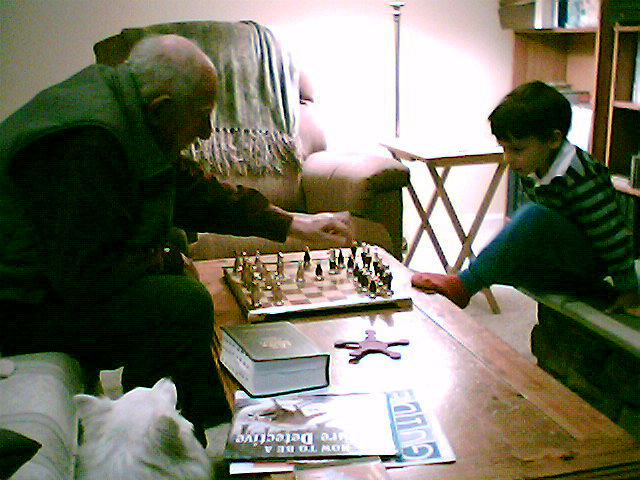

# Ike: A Chess Engine (in progress)

---

Ike will be a chess engine written entirely in Rust (blazingly fast 🦀). It will use techniques like magic bitboards and alpha-beta pruning. 
It will also implement UCI and connect to Lichess.
I was helped immensely by the Chess Programming Wiki (https://www.chessprogramming.org)

Ike is named after my grandfather, who taught me chess when I was a kid. I never did beat him :)  

Ike, Willow (doggo), and me:

